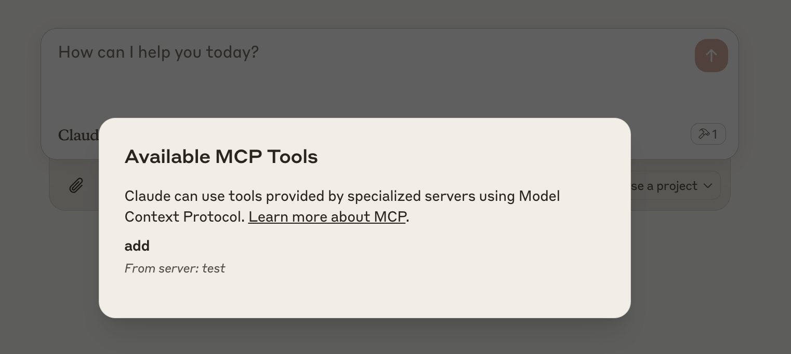

# Acceleronix IoT MCP Server on Cloudflare

A remote MCP (Model Context Protocol) server for Acceleronix IoT platform, deployed on Cloudflare Workers with OAuth authentication. This server enables Claude to interact with your IoT devices through the Acceleronix platform APIs.

## Prerequisites

### 1. Get Acceleronix Platform API Credentials

Before you can use this MCP server, you need to obtain API credentials from the Acceleronix IoT platform:

#### Step 1: Sign up and Access Developer Center
1. **Sign up for Acceleronix Platform**: Visit [Acceleronix Developer Platform](https://iot-api.acceleronix.io) and create an account
2. **Access Developer Center**: Log into your Acceleronix developer dashboard

#### Step 2: Create SaaS Application
Acceleronix SaaS OpenAPIs are used for system integration, enabling product device management and remote control of devices through SaaS applications.

1. **Create a SaaS Application**: 
   - Navigate to **"SaaS Development"** → **"SaaS Management"** menu
   - Click **"Create a SaaS Application"**
   - Fill in the required application information
   - Save your application

#### Step 3: Configure API Services
2. **Enable API Service Packages**:
   - Go to **"SaaS Development"** → **"Service"** page  
   - Enable and authorize the API service packages you need to use
   - **Important**: You can only call the APIs under the service package after authorization

#### Step 4: Authorize Product Access
3. **Authorize Product Data**:
   - Navigate to **"SaaS Development"** → **"Product"** page
   - Authorize product data that the SaaS application can access
   - **Important**: You can only query data under authorized products through the API after authorization

#### Step 5: Get API Credentials
4. **Obtain AccessKey and AccessSecret**:
   - In your SaaS application settings, find your credentials
   - Note down your `ACCESS_KEY` and `ACCESS_SECRET`
   - These credentials will be used to exchange for an access Token when making API calls

### 2. Available IoT Tools

This MCP server provides the following tools for interacting with your IoT devices:

- **list_products** - List all products in your account
- **list_devices** - List devices for a specific product
- **get_device_details** - Get detailed information about a device
- **power_switch** - Control device power on/off
- **query_device_location** - Get device location information
- **query_device_resources** - Get device resource information
- **health_check** - Check MCP server health

## Develop locally

```bash
# clone the repository
git clone https://github.com/Acceleronix/acc-mcp-server.git
cd acc-mcp-server

# install dependencies
npm install

# run locally
npm run dev
```

You should be able to open [`http://localhost:8787/`](http://localhost:8787/) in your browser

## Connect the MCP inspector to your server

To explore your IoT MCP API, you can use the [MCP Inspector](https://modelcontextprotocol.io/docs/tools/inspector).

### For Local Development:
- Start it with `npx @modelcontextprotocol/inspector`
- [Within the inspector](http://localhost:5173), switch the Transport Type to `SSE` and enter `http://localhost:8787/sse`
- You will navigate to a login screen. Input any email and password to login.
- You should be redirected back to the MCP Inspector and can now test IoT tools!

### For Remote Server:
- Use your deployed URL: `https://your-worker-name.your-account.workers.dev/sse`
- Complete the OAuth flow when prompted
- Test tools like `health_check`, `list_products`, `list_devices`, etc.

<div align="center">
  
</div>

<div align="center">
  
</div>

## Connect Claude Desktop to your MCP server

To enable Claude to interact with your IoT devices, follow [Anthropic's Quickstart](https://modelcontextprotocol.io/quickstart/user) and configure Claude Desktop.

### For Local Development:

In Claude Desktop, go to Settings > Developer > Edit Config and add:

```json
{
  "mcpServers": {
    "acceleronix-iot": {
      "command": "npx",
      "args": [
        "mcp-remote",
        "http://localhost:8787/sse"
      ]
    }
  }
}
```

### For Remote Server:

```json
{
  "mcpServers": {
    "acceleronix-iot": {
      "command": "npx",
      "args": [
        "mcp-remote",
        "https://your-worker-name.your-account.workers.dev/sse"
      ]
    }
  }
}
```

Replace `your-worker-name.your-account.workers.dev` with your actual Cloudflare Workers URL.

### Using Claude with IoT Devices

Once connected, you can ask Claude to:
- "List my IoT products"
- "Show me devices for product ABC123"
- "Get details for device XYZ789"
- "Turn on device XYZ789"
- "Get location of device XYZ789"
- "Check the health of my IoT connection"

Claude will use the appropriate MCP tools to interact with your Acceleronix IoT platform.

<div align="center">
  
</div>

<div align="center">
  
</div>

## Deploy to Cloudflare

### 1. Set up KV Namespace (if not already done)

```bash
npx wrangler kv namespace create OAUTH_KV
```

Update the namespace ID in `wrangler.toml` if needed.

### 2. Configure Acceleronix API Credentials

**IMPORTANT**: You must configure your Acceleronix platform credentials as Cloudflare Workers environment variables:

#### Option A: Using Wrangler CLI (Recommended)

```bash
# Set your ACCESS_KEY
npx wrangler secret put ACCESS_KEY
# Enter your ACCESS_KEY when prompted

# Set your ACCESS_SECRET
npx wrangler secret put ACCESS_SECRET
# Enter your ACCESS_SECRET when prompted
```

#### Option B: Using Cloudflare Dashboard

1. Go to [Cloudflare Workers Dashboard](https://dash.cloudflare.com)
2. Select your account and find your deployed worker
3. Go to **Settings** → **Variables**
4. Add the following environment variables:
   - Variable name: `ACCESS_KEY`, Value: Your Acceleronix ACCESS_KEY
   - Variable name: `ACCESS_SECRET`, Value: Your Acceleronix ACCESS_SECRET
5. Click **Save and Deploy**

### 3. Deploy

```bash
npm run deploy
```

### 4. Verify Deployment

After deployment, you can test the health check:

```bash
# Check if your worker is responding (should return 401 - this is expected)
curl -I https://your-worker-name.your-account.workers.dev/sse
```

**Note**: The 401 response is expected - it means OAuth authentication is working correctly.

## Troubleshooting

### Common Issues

#### 1. "Missing required IoT API environment variables" Error

**Cause**: `ACCESS_KEY` and `ACCESS_SECRET` are not properly configured in Cloudflare Workers.

**Solution**: 
- Ensure you've set the environment variables in Cloudflare Workers dashboard or via `wrangler secret put`
- Redeploy after setting variables: `npm run deploy`
- Check the logs: `npx wrangler tail your-worker-name`

#### 2. 401 Unauthorized Error

**Cause**: This is expected behavior when accessing `/sse` directly without OAuth authentication.

**Solution**: This is normal. Use MCP Inspector or Claude Desktop which handle OAuth automatically.

#### 3. "Failed to fetch" in MCP Inspector

**Cause**: Network issues or incorrect URL.

**Solution**:
- Verify your worker URL is correct
- Check if your worker is deployed: `npx wrangler list`
- Try accessing the base URL in browser to confirm it's working

#### 4. Device API Errors

**Cause**: Invalid credentials or API rate limiting.

**Solution**:
- Verify your Acceleronix platform credentials are correct
- Check your account has access to the devices you're trying to query
- Use `health_check` tool to verify API connectivity

### Debugging Commands

#### Check Worker Logs
```bash
npx wrangler tail your-worker-name --format=pretty
```

#### Test MCP Connection Directly
```bash
# For local development
npx mcp-remote http://localhost:8787/sse

# For deployed worker
npx mcp-remote https://your-worker-name.your-account.workers.dev/sse
```

#### Clear OAuth Cache
If you encounter authentication issues:
```bash
rm -rf ~/.mcp-auth
```

#### Check Environment Variables
```bash
npx wrangler secret list
```

## Contributing

Contributions are welcome! Please feel free to submit a Pull Request.

## License

This project is licensed under the MIT License - see the LICENSE file for details.

## Support

For issues related to:

- **Acceleronix IoT Platform**: Contact <support@acceleronix.io>
- **MCP Server Issues**: Open an issue in this repository
- **Claude Desktop Integration**: Check [Anthropic's MCP documentation](https://modelcontextprotocol.io/)